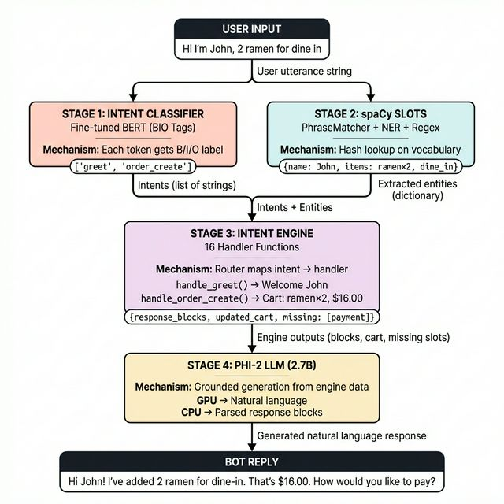

# Pipeline at a Glance
### Sakura Grill Chatbot — MA4891 CA1

---



---

## The Pipeline in One Sentence

> User message → **Trained BERT classifies intent(s)** → **spaCy extracts slots** → **16-handler engine acts on it** → **Phi-2 LLM generates natural reply**

---

## What Makes Us Stand Out — 4 Things

### 1. We Trained Our Own Intent Classifier
Not keyword matching. Not an API call. We labelled data, fine-tuned BERT, and deployed the weights (265 MB).

### 2. Multi-Intent Detection (BIO Span Tagging)
Most chatbots: one intent per message.  
Ours: detects **multiple intents** using the same technique used in NER research.

```
"Order ramen and check hours"
 └── order_create ──┘    └── ask_hours ──┘
```

### 3. Grounded Generation (Not Hallucination)
The LLM doesn't make up prices. It reads **verified data** from the intent engine — the same principle as RAG (Retrieval-Augmented Generation).

### 4. Always Works — GPU or CPU
GPU → full Phi-2 generation with natural language.  
CPU → smart fallback parses engine output directly. Never crashes.

---

## Three NLP Techniques, One Pipeline

| Technique | Tool | Purpose |
|---|---|---|
| **Sequence Labelling** | Fine-tuned BERT (BIO tags) | Know what the user wants |
| **Information Extraction** | spaCy PhraseMatcher + NER | Know the details (items, names, modes) |
| **Text Generation** | Microsoft Phi-2 (2.7B LLM) | Respond naturally |

Each one alone is insufficient. Together they form a **hybrid pipeline** that is accurate, natural, and robust.

---

## Quick Comparison

| | Typical Student Chatbot | Our System |
|---|---|---|
| Intent detection | Keyword rules | Trained BERT model |
| Intents per message | 1 | Multiple (BIO tagging) |
| Entity extraction | `if "ramen" in text` | spaCy PhraseMatcher + NER |
| Response | Template strings | Phi-2 LLM (grounded) |
| UI | Terminal | Streamlit web app |
| Without GPU | Crashes | CPU fallback |
| Scope | 3-5 intents | 16 handlers |
